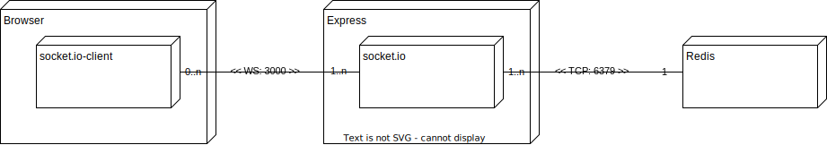
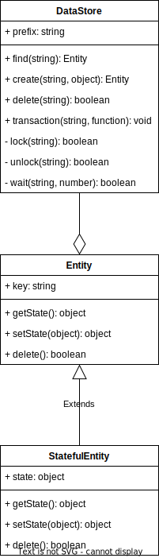

# pubsub-sample

Pub/Sub sample application.

## Getting Started

```bash
npm i
docker-compose up
```

## Component

It is composed with express, socket.io, and redis.



## Class



### DataSource

DataSource handles data each redis namespace.

#### find(id: string): Entity

Returns the entity which matchs with the given id.

```javascript
const roomStore = new DataSource('room');
const room = await roomStore.find('123'); // Search `room:123` from redis
```

#### create(id: string, defaultState: object): Entity

Creates an entity with default state.

#### delete(id: string): boolean

Deletes the entity which matchs with the given id.

#### transaction(id: string, callback: (entity: StatefulEntity) => void): Promise<void>

It enables exclusion control by locking the specific key-value set.  
It prevents conflicts and brings consistency of the data inside callback function.

```javascript
const roomStore = new DataSource('room');
await roomStore.transaction('123', async (statefulEntity) => {
  // Do something
});
```

### Entity

Entity represents key-value set of redis.

```javascript
const room = new Entity(redis, 'room:123');
const state = await room.getState(); // { id: xxx, userName: 'Mike', roomId: 123, darkmode: true }
await room.setState({ darkmode: false });
await room.delete();
```

#### getState(): object

Load the current state from redis.

#### setState(state: object): object

It merge current state and given state shallowly and returns merged state.  
It saves state to redis immediately.

### StatefulEntity

StatefulEntity is special Entity which is used only inside transaction.  
It is argument of the transaction callback.  
Once it load data from redis, it caches data.

```javascript
const roomStore = new DataSource('room');
await roomStore.transaction('123', async (room) => {
  const state = await room.getState(); // { id: xxx, userName: 'Mike', roomId: 123, darkmode: true }
	await room.setState({ darkmode: false });
});
```
